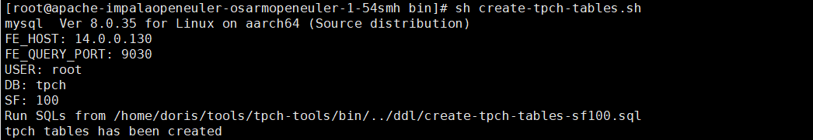
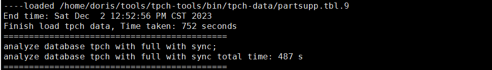
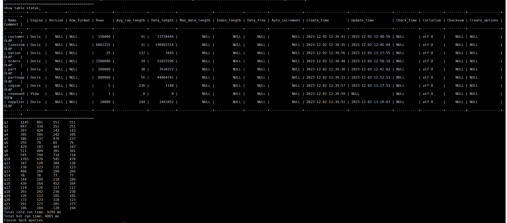
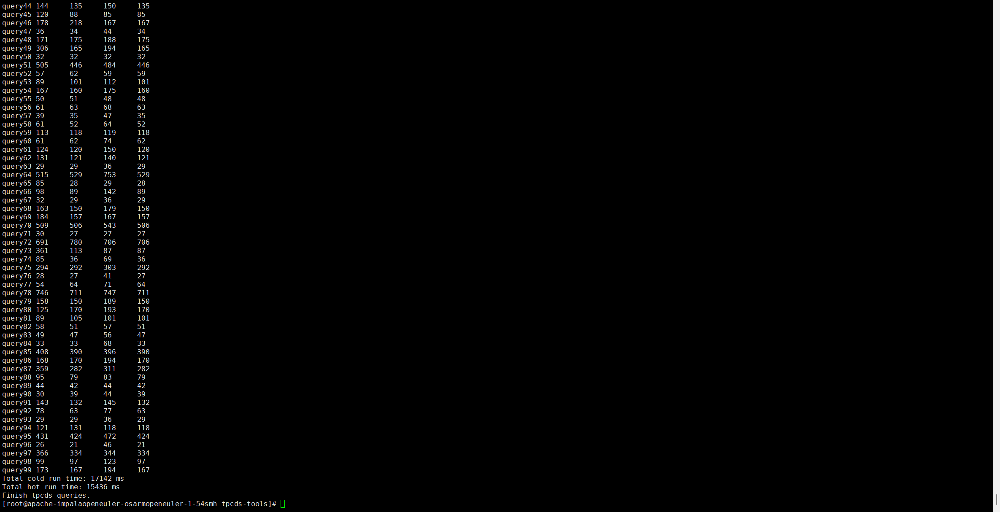
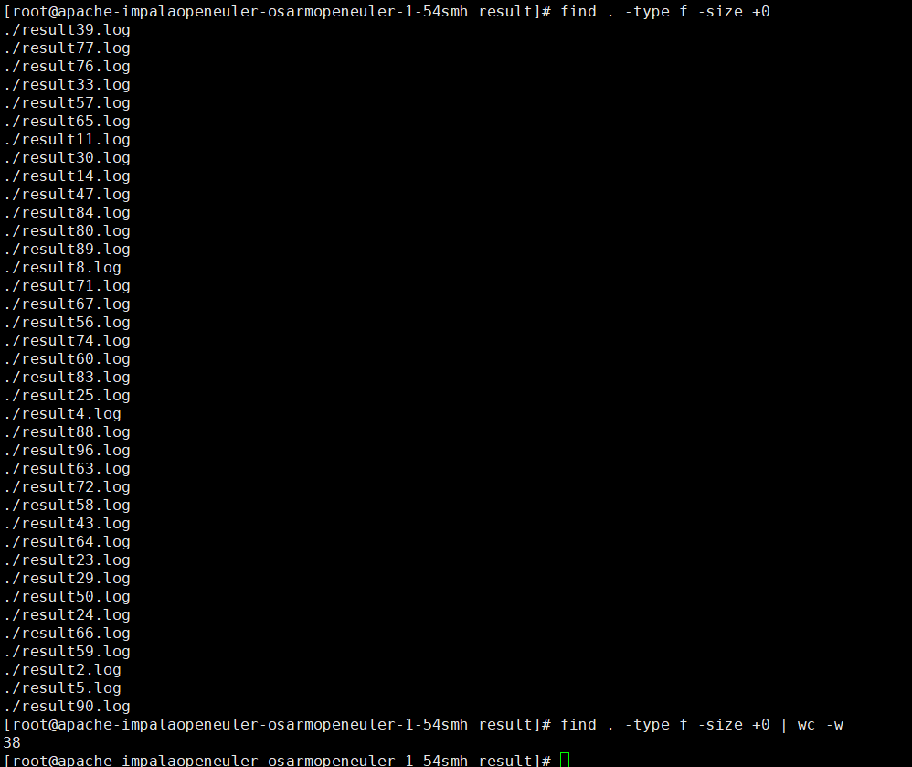

> 本次采用 TPCH 以及 TPCDS 数据集对 doris 进行测试验证。注意：TPCDS 需要 gcc 9 版本，可下载 gcc 9源码进行编译

### TPCH 数据集

##### 测试步骤

1. build  dbgen 工具
   
   `./bin/build-tpch-dbgen.sh`

2. 生成1GB的 tpc-h 数据
   
   `./bin/gen-tpch-data.sh -s 1`

3. 建表
   
   `./bin/create-tpch-tables.sh -s 1`
   
   

4. 导入数据
   
   `./bin/load-tpch-data.sh`
   
   

5. 测试
   
   `./bin/run-tpch-queries.sh -s 1`

##### 测试结果

1GB TPCH 数据集全部测试通过，Cold run time 总计 9249 ms, Hot run time 总计 4865 ms。
具体执行时间及状态如下图所示：

### TPCDS 数据集

> TPCDS 需要 gcc 9进行编译，与 doris 所需 gcc 版本冲突，因此需要单独安装 gcc 9 

1. build dbgen 工具
   
   `export PATH=/usr/bin/:$PATH
   ./bin/build-tpcds-tools.sh`

2. 生成1GB的 tpc-h 数据
   
   `./bin/gen-tpcds-data.sh -s 1`

3. 生成 tpc-ds queries
   
   `./bin/gen-tpcds-queries.sh -s 1`

4. 建表
   
   `./bin/create-tpcds-tables.sh -s 1`

5. 导入数据
   
   `./bin/load-tpcds-data.sh`

6. 测试
   
    `./bin/run-tpcds-queries.sh -s 1`

##### 测试结果

1GB TPCDS 数据集总计 99 条 queries，通过 61 条，取消 pipefail 后执行测试，cold run time 总计 17142 ms, hot run time 总计 15436 ms。
具体执行时间及状态如下图所示：

通过测试的 queries 数目为38，具体信息如下：
